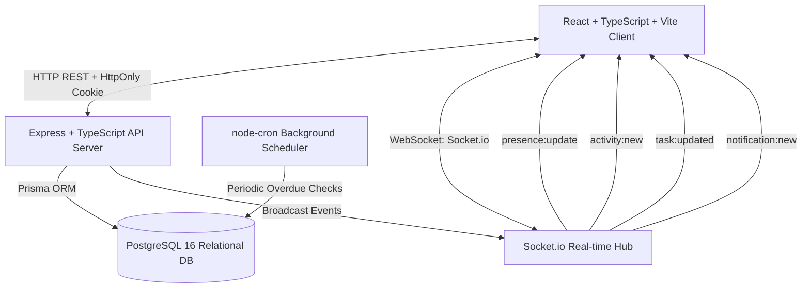
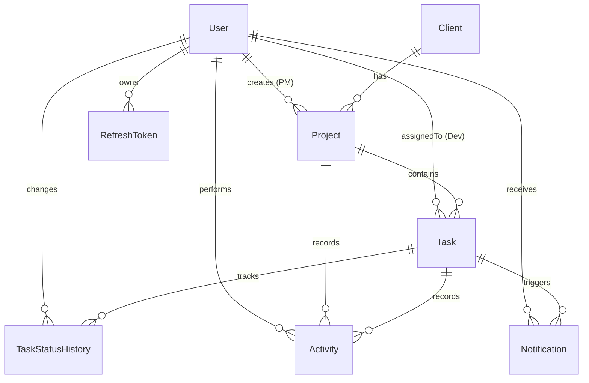

# Velozity Global Solutions — Real-Time Client Project Dashboard

> Technical Hiring Assessment: Real-Time Client Project Dashboard with Role-Based Access & Live Activity Feed.

Built with **React (TypeScript)**, **Node.js (Express + TypeScript)**, **PostgreSQL (Prisma ORM)**, **Socket.io**, and **node-cron**.

---

## 1. Executive Summary & Assessment Explanation (150–250 Words)

> **Assessment Submission Response**  
> **The Hardest Problem Solved:** The central architectural challenge was ensuring that the real-time activity feed and task status updates strictly obeyed role-based access boundaries without leaking unauthorized data or relying on client-side filtering. In an agency with multiple Project Managers and Developers, events cannot simply be broadcast to a global channel. We solved this with a dual-layer distribution model: every status change is persisted as an immutable `TaskStatusHistory` and `Activity` record in PostgreSQL with relational foreign keys, while simultaneously dispatched over targeted Socket.io rooms (`project:<id>`, `user:<userId>`, and `admin:feed`).
>
> **How Real-Time Role-Filtered Feed is Handled:** The backend queries database records with ownership constraints (`createdById` for PMs, `assignedDeveloperId` for Developers, unconditional for Admins). Live events are routed through project-specific rooms and private user rooms so users only receive events they are authorized to see. Offline catchup queries PostgreSQL directly for the last 20 events matching the user’s database-verified permissions.
>
> **What I Would Do Differently in Production:** While `node-cron` and in-memory presence tracking are lightweight and zero-dependency for single-instance deployments, in an enterprise multi-node environment I would introduce **Redis** with `@socket.io/redis-adapter` for distributed pub/sub presence and **BullMQ** for distributed overdue job processing.

---

## 2. System Architecture



---

## 3. Seeded Demo Accounts (One-Click Testing)

All seed accounts share the default password: **`Password123!`**

| Role | Name | Email | Permissions & Access Scope |
| :--- | :--- | :--- | :--- |
| **ADMIN** | Marcus Vance | `marcus.vance@velozity.io` | Global access: view/manage all clients, projects, tasks, global live feed, and active user presence count. |
| **PROJECT_MANAGER** | Sarah Jenkins | `sarah.jenkins@velozity.io` | Manages own projects (Apex Core Banking, Lumina Inventory), assigns tasks to developers, scoped feed. |
| **PROJECT_MANAGER** | David Sterling | `david.sterling@velozity.io` | Manages own project (Horizon Telehealth), team activity feed, isolated from Sarah's projects. |
| **DEVELOPER** | Elena Rostova | `elena.rostova@velozity.io` | Assigned tasks only, status updater (To Do → In Progress → In Review → Done), scoped feed. |
| **DEVELOPER** | Alex Chen | `alex.chen@velozity.io` | Assigned tasks only, cannot access Elena's tasks or PM projects. |
| **DEVELOPER** | Priya Patel | `priya.patel@velozity.io` | Assigned tasks only (including overdue settlement task). |
| **DEVELOPER** | Liam O'Connor | `liam.oconnor@velozity.io` | Assigned tasks only. |

*Tip: The top navigation bar in the UI includes a **"Switch Role"** evaluator dropdown to instantly switch between these personas.*

---

## 4. Local Setup & Docker Instructions

### Prerequisites
- [Docker & Docker Compose](https://www.docker.com/)
- [Node.js](https://nodejs.org/) v20+ and npm

### Step 1: Start PostgreSQL with Docker
```bash
docker compose up -d postgres
```
*PostgreSQL will be running on port `5432` with user `postgres` and database `velozity_db`.*

### Step 2: Install Dependencies
```bash
npm install
```

### Step 3: Run Database Migrations & Seed Data
```bash
cd server
npm run prisma:migrate
npm run prisma:seed
cd ..
```
*This populates the database with 1 Admin, 2 PMs, 4 Developers, 3 Clients, 3 Projects, 15+ Tasks (including overdue tasks), Activity history, and Notifications.*

### Step 4: Run Automated Tests
```bash
cd server
npm test
```
*Runs all 38 integration and security tests covering RBAC, token tampering, direct URL attacks, and resource ownership.*

### Step 5: Start Development Servers
From the repository root:
```bash
npm run dev
```
- **Frontend Dashboard:** [http://localhost:5173](http://localhost:5173)
- **Backend API Server:** [http://localhost:4000](http://localhost:4000)
- **API Health Check:** [http://localhost:4000/api/health](http://localhost:4000/api/health)

---

## 5. Database Schema & Indexing Rationale

### ER Diagram



### Indexing Rationale
1. **`Task [assignedDeveloperId, status, priority, dueDate]`**:
   Developer dashboard queries sort by priority (Critical → High → Medium → Low) then due date for a specific developer. This composite index allows index-only scans without in-memory sorting.
2. **`Task [projectId, status]`**:
   Accelerates project task board listings and status aggregations for PM dashboards.
3. **`Activity [projectId, createdAt]` & `Activity [taskId, createdAt]`**:
   Supports high-throughput real-time missed-event catchup queries for project-specific and task-specific feeds.
4. **`Notification [userId, read]`**:
   Optimizes unread notification badge counter (`count({ where: { userId, read: false } })`).
5. **`RefreshToken [tokenHash]`**:
   O(1) index lookup when validating and rotating refresh tokens upon rotation requests.

---

## 6. Architectural Decisions

### A. Real-Time WebSocket Implementation (Socket.io)
- **Decision:** Socket.io over raw native WebSockets.
- **Rationale:**
  - Automatic reconnection with exponential backoff and buffered packet re-transmission.
  - Native room abstraction (`project:<id>`, `user:<id>`, `admin:feed`) enabling targeted, role-safe broadcasting without data leakage.
  - Built-in connection state recovery and WebSocket-to-polling fallback in restrictive corporate proxy environments.

### B. Background Scheduler (node-cron)
- **Decision:** `node-cron` over Bull/Redis.
- **Rationale:**
  - Lean operational footprint: eliminates Redis operational overhead for single-instance internal agency dashboards.
  - Deterministic cron sweep (`*/10 * * * *`) that queries the PostgreSQL composite index `dueDate < NOW() AND status != 'DONE'`.
  - Automatically notifies assigned developers and project managers when deadlines are breached.

### C. Authentication & Token Storage
- **Decision:** Short-lived JWT Access Token in memory + Long-lived Refresh Token in `HttpOnly`, `SameSite=Lax` cookie.
- **Rationale:**
  - Storing access tokens in memory prevents malicious JavaScript from reading tokens via XSS.
  - Storing refresh tokens in `HttpOnly` cookies guarantees tokens cannot be accessed by `document.cookie` or client scripts.
  - Refresh tokens are hashed using SHA-256 before storage in PostgreSQL, protecting user sessions even in the event of database dumps.
  - Refresh token rotation (RTR) on every refresh request with automatic invalidation.

### D. API-Level RBAC & Security Enforcement
- **Backend Derivation:** Authorization is derived strictly from the authenticated user and PostgreSQL database state—never from client input.
- **Anti-Tampering:**
  - Modifying `projectId` in task requests or `createdById` in project updates is stripped server-side.
  - Direct URL attacks (e.g. PM A requesting PM B's project ID) return `404 Not Found` to prevent resource existence disclosure.
  - Even if a client forged an access token claiming `role: "ADMIN"`, the backend loads the verified database role (`user.role`) before critical operations.

---

## 7. Known Limitations & Production Enhancements
1. **Multi-Node WebSocket Scaling:** In an auto-scaling cluster with multiple server instances, Socket.io rooms require `@socket.io/redis-adapter` for cross-node event propagation.
2. **File Attachments:** Task deliverables and client specification documents currently support URL links and markdown notes; direct S3/Cloudflare R2 multipart uploads could be added.
